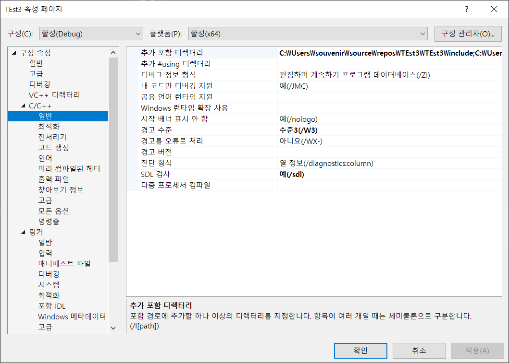
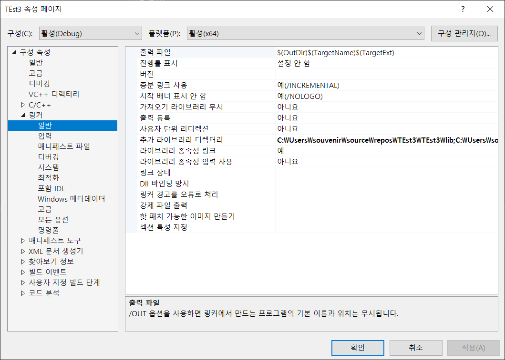
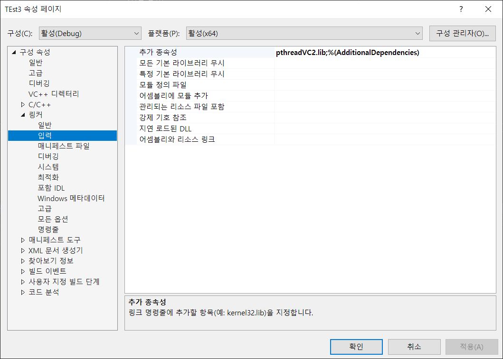
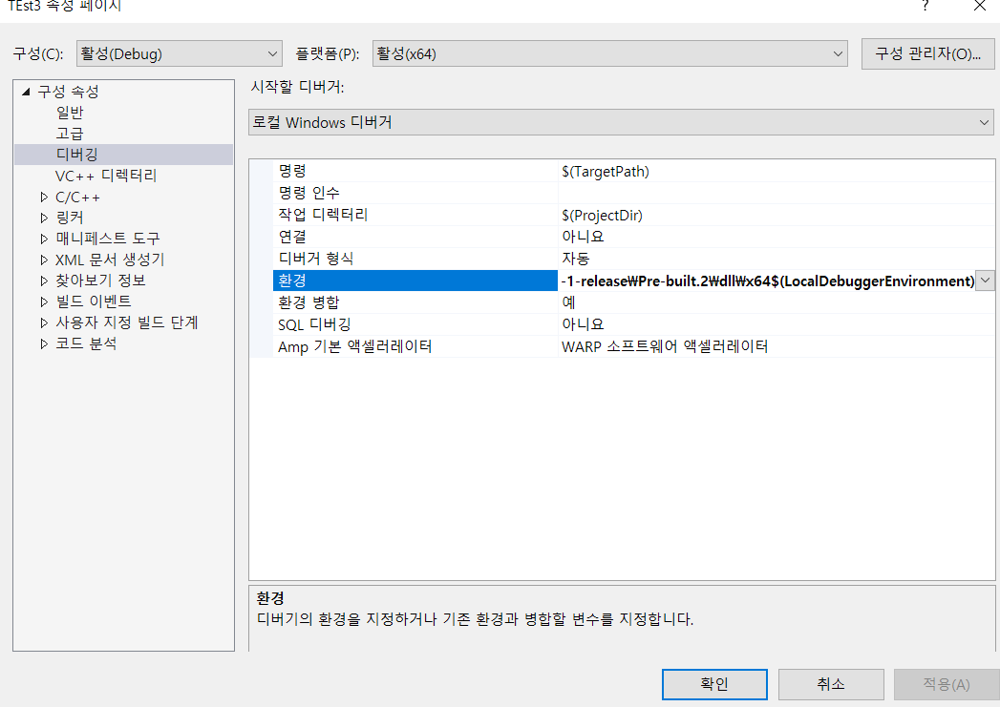

# DJ_Keyboard
## 비가 내리고 음악이 흐르면....
yo  
DJ  
keyboard  
let's get it  
man

## Overview
해당 게임은 떨어지는 단어들을 입력하여 하나의 멜로디를 만드는 게임입니다.
단어들이 매시간 떨어지는데, 해당 글자를 입력하면 그 길이만큼 멜로디가 생성되게 됩니다.
멜로디가 너무 많다 싶으면 자동으로 몇 개를 삭제하게 됩니다.
게임이 끝나면 해당 멜로디는 .wav파일로 저장됩니다.

## How to install
- Visual Studio 2019 기준입니다.
### clone it
```
git clone https://github.com/501Pb/DJ_Keyboard.git
```
### irrKlang setting
1. 프로젝트 세팅에 들어 갑니다.
2. C/C++ 구성 속성에 추가 포함 디렉토리에 해당 include 폴더를 추가합니다.

3. 링커의 추가 라이브러리 디렉터리에 해당 lib 폴더를 추가합니다.

4. 링커 - 입력의 추가 종속성에 irrKlang.lib을 추가합니다.


### pthread setting
1. 프로젝트 세팅에 들어 갑니다.
2. C/C++ 구성 속성에 추가 포함 디렉토리에 해당 include 폴더를 추가합니다.

3. 링커의 추가 라이브러리 디렉터리에 해당 lib 폴더를 추가합니다.

4. 링커 - 입력의 추가 종속성에 pthreadVC2.lib을 추가합니다.

5. 디버깅에 환경에 dll 폴더를 추가합니다.


## Members
[권나성](https://github.com/kwonnaseong)
[김광호](https://github.com/FKgk)
[김수빈](https://github.com/kimziou77)
[이현빈](https://github.com/Phaskal)
